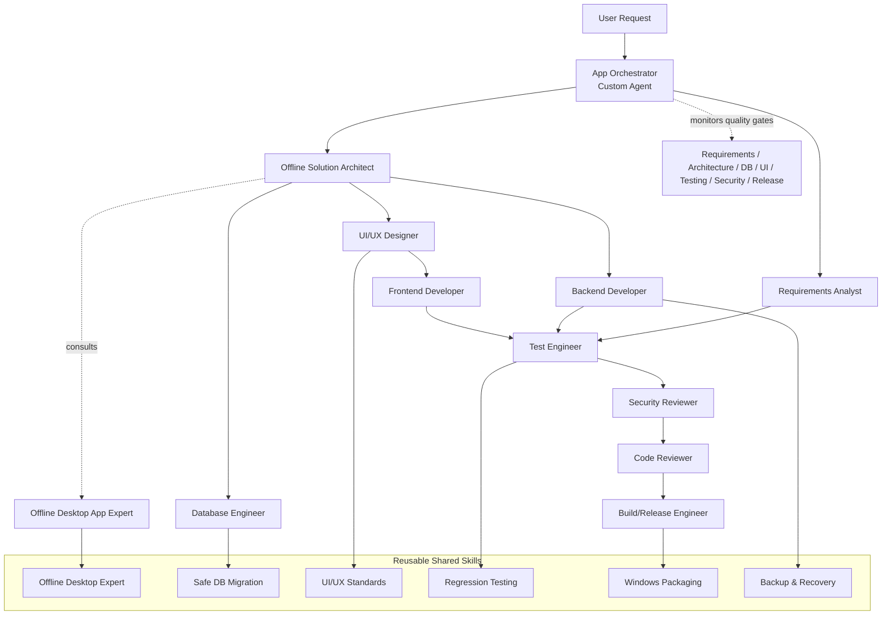

# Multi-Skill Software Development Framework

## Overview

This repository implements a reusable repo-local software-delivery framework for offline desktop and business applications.

## Primary entry point

The App Orchestrator is the default starting point for work requests. It classifies tasks, inspects the repository, selects the smallest required specialist set, delegates work, and coordinates validation.

## Specialist roles

- App Orchestrator
- Requirements Analyst
- Offline Solution Architect
- UI/UX Designer
- Frontend Developer
- Backend Developer
- Database Engineer
- Test Engineer
- Security Reviewer
- Code Reviewer
- Build/Release Engineer
- Offline Desktop App Expert

## Interaction model



### Visual orchestration view

```text
YOU
                     │
                     ▼
            ┌─────────────────┐
            │ App Orchestrator│
            │ Custom Agent    │
            └────────┬────────┘
                     │
           invokes specialist agents
                     │
    ┌────────────────┼────────────────────┐
    │                │                    │
    ▼                ▼                    ▼
 Architect      UI/UX Designer      Requirements
    │                │                    │
    ├──────────┬─────┴───────┐            │
    ▼          ▼             ▼            │
 Backend    Frontend      Database         │
    │          │             │            │
    └──────────┴──────┬──────┘            │
                      ▼                   │
                    Tester ◄──────────────┘
                      │
               Security Review
                      │
                 Code Review
                      │
                Build/Release

        All agents can load reusable SKILLS

        ┌─────────────────────────────┐
        │ Offline Desktop Expert      │
        │ Safe DB Migration           │
        │ UI/UX Standards             │
        │ Regression Testing          │
        │ Windows Packaging           │
        │ Backup & Recovery           │
        └─────────────────────────────┘
```

## Handoff rules

- Requirements Analyst produces requirements.
- Architect consumes requirements and produces architecture.
- UI/UX Designer consumes requirements + architecture and produces design guidance.
- Database Engineer reviews data impact and migration risk.
- Backend Developer implements services and business logic.
- Frontend Developer implements the approved UI.
- Test Engineer validates functional and regression behavior.
- Security Reviewer reviews risks.
- Code Reviewer independently checks the completed implementation.
- Build/Release Engineer packages only after review and validation gates pass.

## Quality gates

1. Requirements understood
2. Architecture defined
3. Database impact reviewed
4. UI/UX defined where applicable
5. Implementation completed
6. Automated tests pass
7. Security review completed
8. Independent code review completed
9. Critical defects resolved
10. Regression tests pass
11. Release/build validated

## Safe change principles

- Minimize scope.
- Preserve existing behavior.
- Reuse existing architecture unless a strong reason requires change.
- Keep database migrations safe and backward compatible.
- Validate with tests and review before release.

## Example requests

- "Use the app orchestrator to create an offline computer repair shop application."
- "Use the app orchestrator to add customer photo capture using webcam."
- "Review this application using the architecture, security, database, testing and code-review skills."
- "Improve the UI/UX of the current application without changing existing functionality."
- "Create a Windows production build of this application."
